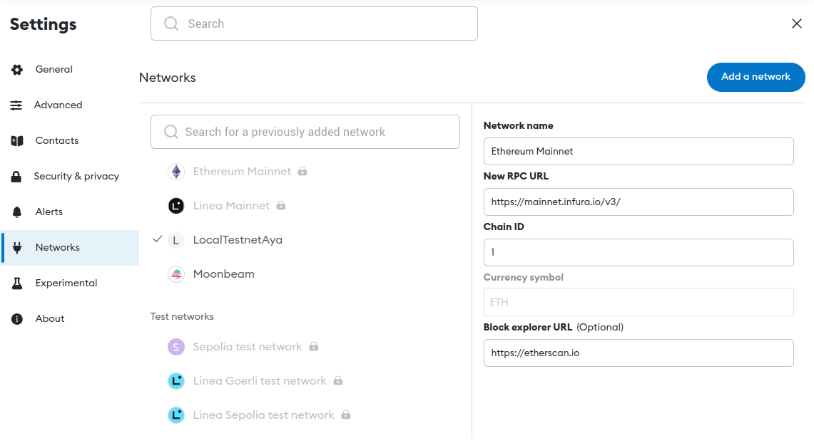
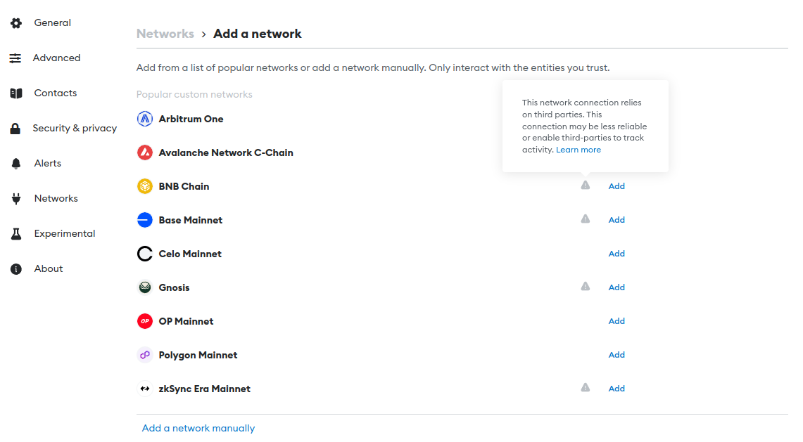
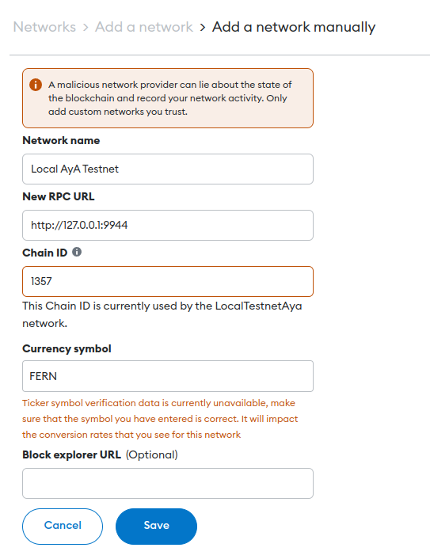
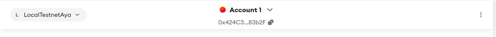
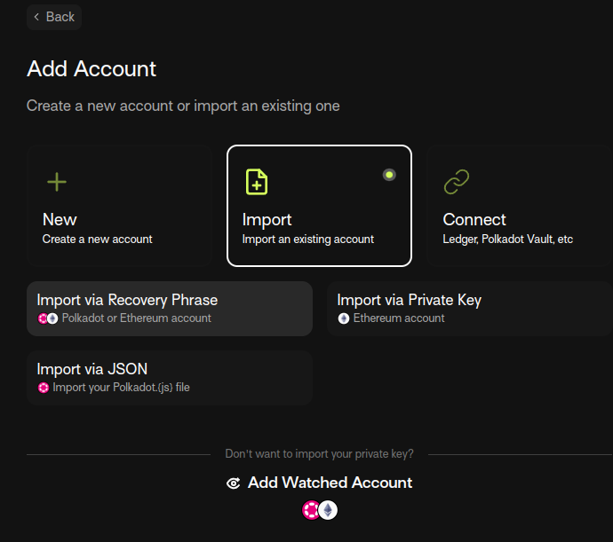
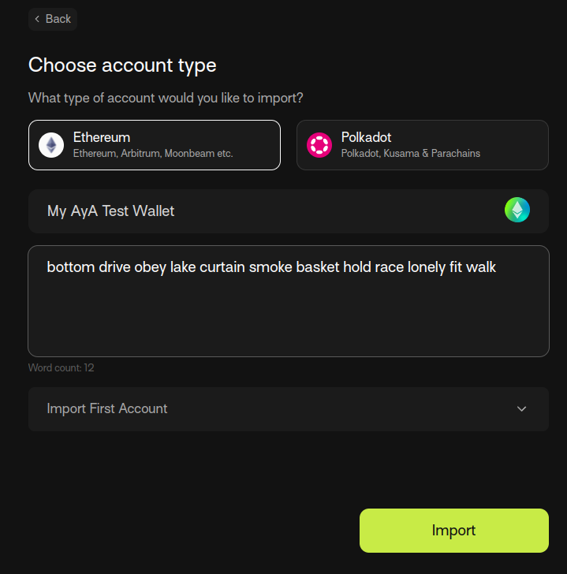
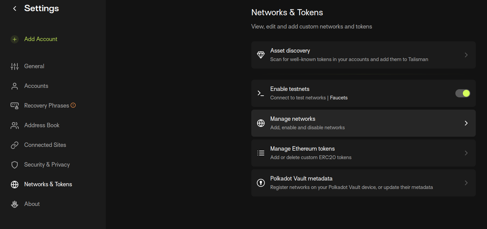
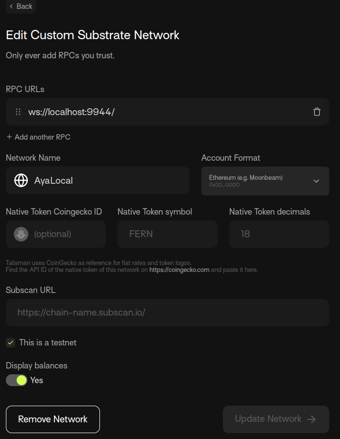
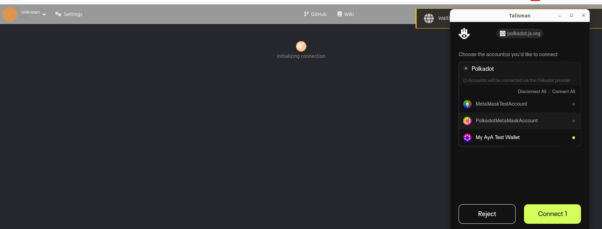
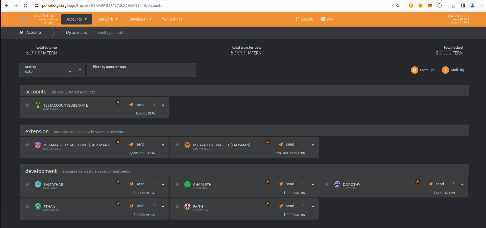

# Custom Accounts

This guide shows how to create and configure a wallet to interact with a local AyA Blockchain. For that purpose you should have a local network running already. You can do this by starting a `--dev` instance of the node or by following the [Local Chain Setup Guide](/guide_local_chain_setup.md).

It is possible to use MetaMask for transfering funds but it is not possible to interact with polkadotjs and the more complex chain functions using MetaMask. For that purpose we use the Talisman wallet. 

## MetaMask

AyA works with usual Ethereum accounts and there is nothing special needed beside configuring a network on MetaMask. 
We recommend you to create a new account in metamask for testing Aya. 

### Install MetaMask

To install the MetaMask browser extension please follow the instructions on metamask.io:
[MetaMask Download](`https://metamask.io/download/`)

We assume you are familiar with crypto wallets, please create yourself a new account for testing with AyA and note down the recovery phrase, so you can reuse this account. 

#### Configure RPC Endpoints

Interacting with AyA from a wallet requires to configure the network in MetaMask. 

Open MetaMask and go to `Settings`:

Go to `Networks` in the menu on the left and then click on the blue Button `Add a network` on the right side:



This will show you a list of available networks but we need to `Add a network manually`:



Enter the values below and click save: 



Select the network via the selector in the top left corner: 


Congratulations you successfully connected your MetaMask wallet to AyA. Copy your address go to the [polkadotjs web interface](https://polkadot.js.org/apps/?rpc=ws%3A%2F%2F127.0.0.1%3A9944#/accounts) and send some funds from one of the development accounts. 


## Talisman

To be able to interact with AyA's advanced functionallty, a wallet able to connect to polkadotjs is needed. MetaMask is not able to do this out of the box, we recommend to use the Talisman wallet for now.

For this tutorial we will restore the same wallet you created in MetaMask so we assume you have your recovery keys from the first part available. 

**We will use the well known mnemonic from Alice for this tutorial, this mnemonic is publicly known and should only be used for demonstration purposes:**

```
bottom drive obey lake curtain smoke basket hold race lonely fit walk
```

### Install the Talisman Browser Extension

Go to the [Talisman Website](https://www.talisman.xyz/) and follow the instructions to install the talisman wallet extension.

#### Restore MetaMask Wallet in Talisman 

As mentioned above we want to restore the same account we used in MetaMask. Open the browser extension and click on the three dots `...` in the bottom right corner, click `Add Account`.

Select `Import` and choose `Import via Recovery Phrase`:



In the following dialog we need to select the account type, choose `Ethereum`, give your wallet a name and enter your mnemonic: 



Click `Import`. 

We successfully added the account to the Talisman Wallet but we also need to configure the network to be able to connect with the AyA blockchain. 

Go to `Settings` -> `Network & Tokens` -> `Manage Networks`:



In the following dialog first select `Polkadot` and then click `+ Add network`:


Make sure the node you connect to is started with the flag `--unsafe-rpc-external` as RPC websockets are disabled for validator nodes by default. In a production environment, the RPC endpoints of a validator should never be exposed!
You can also configure a full node conected to the network with TLS termination on the RPC socket (the proper way to connect to a blockchain node, but we assume here a local devnet).

Enter the following information for the network and save: 



#### Connect to polkadotjs

Go to [polkadotjs web interface](https://polkadot.js.org/apps/?rpc=ws%3A%2F%2F127.0.0.1%3A9944#/accounts) 

When entering the web interface, the Talisman wallet should pop up and ask you to connect to the website: 



Choose the AyA Test Account you restored before and click `Connect 1`

Congratulations, you are now able to interact with the AyA chain using your own wallet. Your connected accounts are displayed under `extension`.



