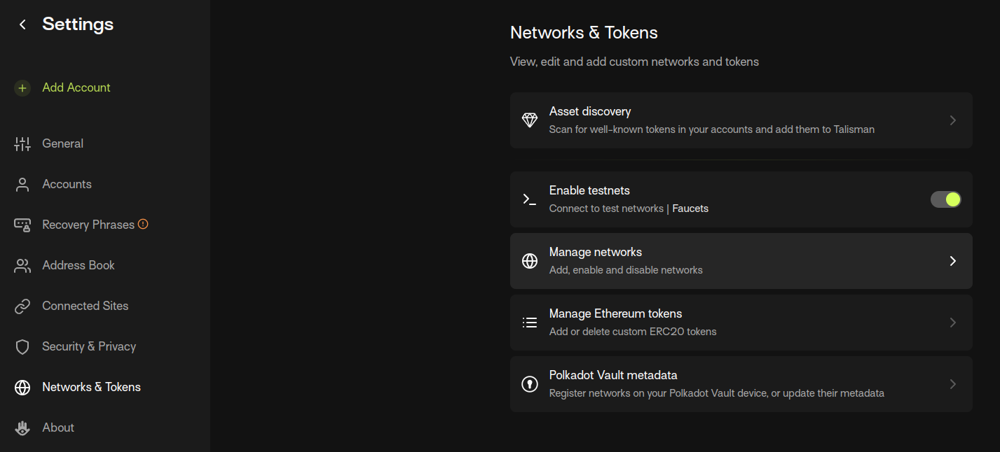
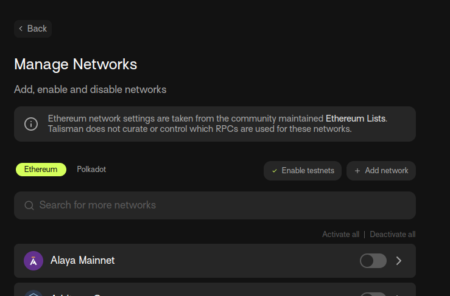
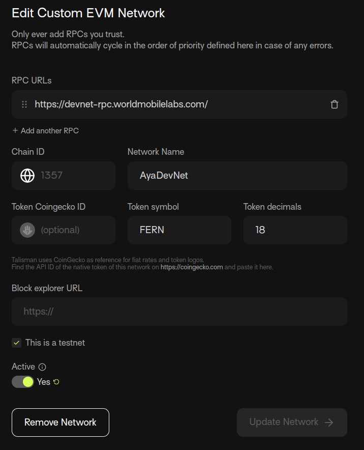
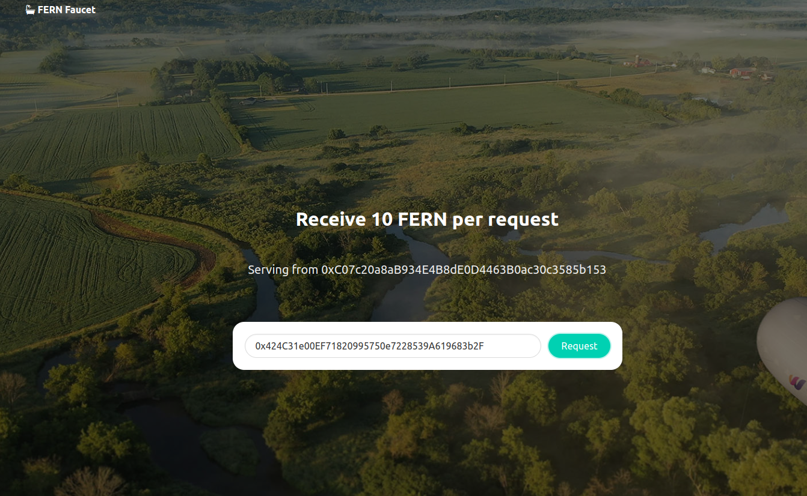
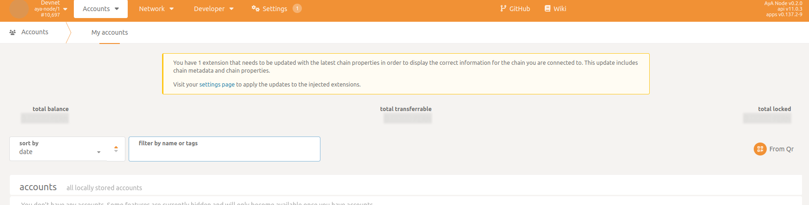
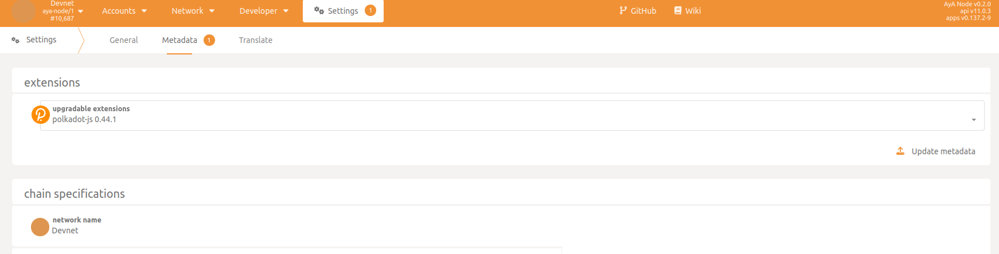
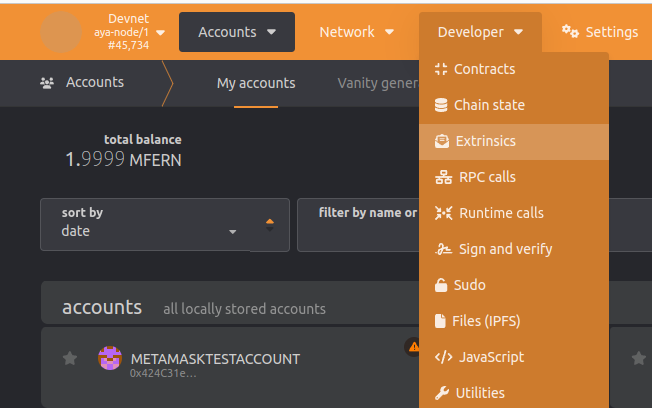
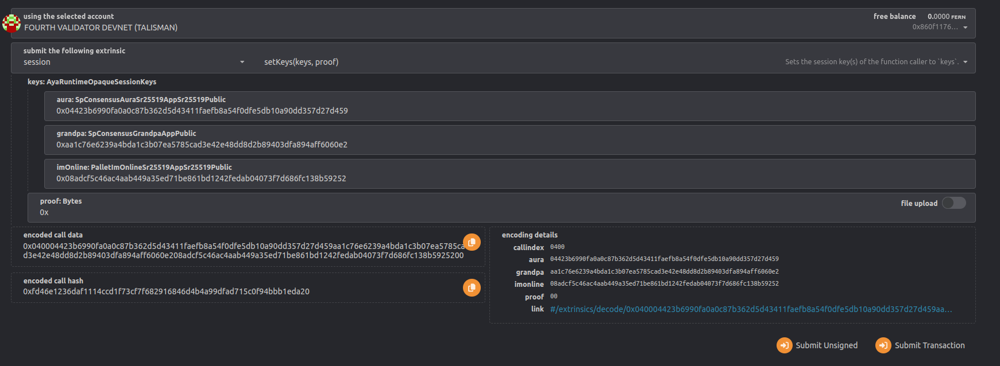

# Join the World Mobile DevNet

Also see the community contributions which you might more comfortable to follow:

Ricks Guides: https://github.com/ricksteruk/aya_devnet_guide/tree/main

Welcome, lets start!

## 1. Minimal Server Requirements

**Operating System**: Ubuntu 22.04  
**CPU**: 2x vCPU  
**Memory**: 8 GB  
**Storage**: ~250 GB

## 2. Update your Operating System

```bash
sudo apt update && sudo apt upgrade
```

## 3. Install AyA

### 3.1 From sources

#### 3.1.1 Setup Rust

Install dependencies:

```bash
sudo apt install -y curl git clang libssl-dev llvm libudev-dev make protobuf-compiler pkg-config build-essential
```

Install Rust:

```bash
curl --proto '=https' --tlsv1.2 -sSf https://sh.rustup.rs | sh
```

Proceed with option 1 _"Standard Installation"_ when installing.

Get Rust environment into terminal session:

```bash
source $HOME/.cargo/env
```

Check Rust is installed correctly

```bash
rustc --version
```

Configure Rust toolchain:

```bash
rustup default stable
rustup component add rust-src --toolchain stable-x86_64-unknown-linux-gnu
rustup target add wasm32-unknown-unknown
rustup update
```

Check Rust Installation:

```bash
rustup show
```

#### 3.1.2 Build AyA-Node

Building the binary can take a long time depending on the resources of the server.

Clone the AyA-Node Repository:

```bash
git clone https://github.com/worldmobilegroup/aya-node.git
cd aya-node
```

For DevNet we checkout the devnet version of the aya-node and create a new local branch:

```bash
git checkout tags/devnet-v0.3.0 -b my-devnet-branch
```

Compile the AyA-Node:

```bash
cargo build --release
```

### 3.2 Precompiled Binaries

If you do not want to build the aya-node from source, you can use the precompiled binaries:

[Release DevNet AyA Node v0.3.0](https://github.com/worldmobilegroup/aya-node/releases/tag/devnet-v0.3.0)

Download and copy the `aya-node` and `wm-devnet-chainspec.json` files to your server.

The guide assumes you built from source so make sure you adjust file paths. To get the same folder structure as for the
build from source option, create the folder `aya-node/target/release` and copy the `aya-node` binary into it.
The `wm-devnet-chainspec.json` would be expected in the folder `aya-node/`.

    .
    └── aya-node
        ├── target
        │  └── release
        │      └── aya-node
        └── wm-devnet-chainspec.json

## 4. Setting Up systemd

We want that our validator starts automatically with the server and is restarted automatically. For that purpose we
create a systemd service (Ubuntu 22.04).

First we create a startup script for the AyA-Node.

Make sure the path to the aya-node binary is correct in the command below. It is expected you cloned and compiled the
repository on the validator machine in your users home folder. In this case the aya-node would be located
in `/home/myuser/aya-node/target/release`.

Set AyA Home Path to the folder were your aya-node binary is located:

```bash
export AYA_HOME=/home/${USER}/aya-node
```

Set `AYA_HOME` on server start:

```bash
sudo bash -c "echo 'export AYA_HOME=/home/${USER}/aya-node' >> /etc/bash.bashrc"
```

Create Startup Script:

```bash
echo '#!/usr/bin/env bash' > start_aya_validator.sh
echo "${AYA_HOME}/target/release/aya-node \
    --base-path ${AYA_HOME}/data/validator \
    --validator \
    --chain ${AYA_HOME}/wm-devnet-chainspec.json \
    --port 30333 \
    --rpc-port 9944 \
    --log info \
    --bootnodes /dns/devnet-rpc.worldmobilelabs.com/tcp/30340/ws/p2p/12D3KooWRWZpEJygTo38qwwutM1Yo7dQQn8xw1zAAWpfMiAqbmyK" >> start_aya_validator.sh
sudo chmod +x ./start_aya_validator.sh
```

Let us test that the validator starts by executing the script we just created

```bash
./start_aya_validator.sh
```

The validator should start syncing, if there is a problem check the path to the `aya-node` binary and
the `wm-devnet-chainspec.json`.

Stop the aya-node again by pressing Ctrl+C.

### Create a systemd service

Next we create the systemd service:

```bash
sudo tee /etc/systemd/system/aya-node.service > /dev/null <<EOF
#Start the Aya validator
[Unit]
Description=AyA Node
After=network.target

[Service]
WorkingDirectory=${AYA_HOME}
ExecStart="${AYA_HOME}"/start_aya_validator.sh
User=${USER}
Restart=always
RestartSec=90
#Set the maximum number of file descriptors
LimitNOFILE=4096

[Install]
WantedBy=multi-user.target
EOF
```

Enable the service:

```bash
sudo systemctl enable aya-node.service
```

Start the node via systemd:

```bash
sudo systemctl start aya-node.service
```

Check the service is running:

```bash
sudo systemctl status aya-node.service
```

If there is a problem check that all paths are fine first, that is the most common problem.

You can look at the logs with:

```bash
sudo journalctl -u aya-node.service
```

If you want to follow the logs use:

```bash
sudo journalctl -f -u aya-node.service
```

In case your systemd service is not working properly you can find debugging information in this log.

If everything worked out you should have a running full node / validator which is syncing with the blockchain (but not
validating blocks).
You can see in the logs that the node is importing blocks.

If you just want to setup a full node you can stop here.

## 5. Get your keys

> [!CAUTION]
> The mnemonic used in this tutorial is an EXAMPLE and is PUBLICLY USED for ALICE, BOB,... DO NOT USE it; Replace *"
bottom drive obey lake curtain smoke basket hold race lonely fit walk"* with your own generated mnemonic.

### 5.1 Substrate

You have 2 ways to generate your keys: 

* Using [subkey](guide_keys_subkey.md)
* Using [aya-node binary](guide_keys_aya_bin.md) 

> [!NOTE] If you want to use the scripts in the utils folder of the aya-node repository you need to install subkey.

### 5.2 EVM Account and Derived Keys

**If you use the mnemonic without derivation throughout this guide, there is no need to execute this part 5.1 as you
will restore the mnemonic in a wallet and have your address there. Anyway this part has useful information for key
handling**

Subkey / Aya-Node unfortunately do not give us all information as they cannot derive the EVM account. To calculate the
EVM account from the mnemonic you can use the `validator_keys.sh` script in the `utils/account_derivation_tools/scripts`
folder of the aya-node repository. Be aware that the scripts expect `subkey` to be installed in `/usr/bin`. The script
will create the EVM account with the address_index 0 only. See also the Readme in `utils/account_derivation_tools`.

You need to have npm and node js installed:

```bash
sudo apt update
sudo apt install nodejs
sudo apt install npm
```

Next, install the dependencies (we assume you are on the projects root directory):

```bash
cd utils/account_derivation_tools/tools/keys
npm i
cd ../..
```

Execute the script using your generated mnemonic as input parameter.

Example:

```bash
./scripts/validator_keys.sh "bottom drive obey lake curtain smoke basket hold race lonely fit walk"
``` 

Example Output:

```
Processing account:

sr25519

Secret phrase:       bottom drive obey lake curtain smoke basket hold race lonely fit walk
  Network ID:        substrate
  Secret seed:       0xfac7959dbfe72f052e5a0c3c8d6530f202b02fd8f9f5ca3580ec8deb7797479e
  Public key (hex):  0x46ebddef8cd9bb167dc30878d7113b7e168e6f0646beffd77d69d39bad76b47a
  Account ID:        0x46ebddef8cd9bb167dc30878d7113b7e168e6f0646beffd77d69d39bad76b47a
  Public key (SS58): 5DfhGyQdFobKM8NsWvEeAKk5EQQgYe9AydgJ7rMB6E1EqRzV
  SS58 Address:      5DfhGyQdFobKM8NsWvEeAKk5EQQgYe9AydgJ7rMB6E1EqRzV

ed25519

Secret phrase:       bottom drive obey lake curtain smoke basket hold race lonely fit walk
  Network ID:        substrate
  Secret seed:       0xfac7959dbfe72f052e5a0c3c8d6530f202b02fd8f9f5ca3580ec8deb7797479e
  Public key (hex):  0x345071da55e5dccefaaa440339415ef9f2663338a38f7da0df21be5ab4e055ef
  Account ID:        0x345071da55e5dccefaaa440339415ef9f2663338a38f7da0df21be5ab4e055ef
  Public key (SS58): 5DFJF7tY4bpbpcKPJcBTQaKuCDEPCpiz8TRjpmLeTtweqmXL
  SS58 Address:      5DFJF7tY4bpbpcKPJcBTQaKuCDEPCpiz8TRjpmLeTtweqmXL

Compressed EVM key: 	0xf24FF3a9CF04c71Dbc94D0b566f7A27B94566cac
Private key: 			0x5fb92d6e98884f76de468fa3f6278f8807c48bebc13595d45af5bdc4da702133

------------
```

You can also get the compressed EVM key by restoring the mnemonic in a ethereum wallet e.g. MetaMask or Talisman. You
can choose in the wallet what address_indexes you want to add.

***Additional Information:***

If you want to use a derived key the sr25519 and the ed25519 private keys will be different.
To calculate a EVM address you need to know the derivation path and for some derivation path you cannot calculate an EVM
account.
EVM accounts use the derivation path `m//44//60//0/0/<address_index>`,
see [BIP44](https://github.com/bitcoin/bips/blob/master/bip-0044.mediawiki) for more information.
You can use a different mnemonic to register your session keys, for example using a hardware wallet.

You can derive a key from your mnemonic only you know.

For example to get AURA and IM_ONLINE Key:

```bash
subkey inspect --scheme sr25519 "bottom drive obey lake curtain smoke basket hold race lonely fit walk//My//Secret//Derivation//Path"
```

For example to get a GRANDPA Key:

```bash
subkey inspect --scheme ed25519 "bottom drive obey lake curtain smoke basket hold race lonely fit walk//My//Secret//Derivation//Path"
```

This would result in the following private keys for your validator:

```
sr25519

Secret Key URI `bottom drive obey lake curtain smoke basket hold race lonely fit walk//My//Secret//Derivation//Path` is account:
  Network ID:        substrate
  Secret seed:       0xd159936a485167ec22d29876190adb9f8ed08879a28b46f9ee075ef3dcd7b4f2
  Public key (hex):  0x00209b81aef17a150140d06979eb54bb23d8f7f72a25d7a1b429c72cdf19f555
  Account ID:        0x00209b81aef17a150140d06979eb54bb23d8f7f72a25d7a1b429c72cdf19f555
  Public key (SS58): 5C4sYUugQF27DktbzXhSVJNuMtJrFVvPP61bumtvTYKmTqak
  SS58 Address:      5C4sYUugQF27DktbzXhSVJNuMtJrFVvPP61bumtvTYKmTqak

ed25519

Secret Key URI `bottom drive obey lake curtain smoke basket hold race lonely fit walk//My//Secret//Derivation//Path` is account:
  Network ID:        substrate
  Secret seed:       0xd64f614f9a1c218a43e7a066e8676dd23ef2ccab82232dae7180af50f788e376
  Public key (hex):  0x579f175039ffaad0740f6e578235940a0e6ef0e8f3a9554334e2cf475fb38f6d
  Account ID:        0x579f175039ffaad0740f6e578235940a0e6ef0e8f3a9554334e2cf475fb38f6d
  Public key (SS58): 5E3bHNRo6pxpUetjZxZ5XWGaPcRF7RM7ZUbySuiLPZ1cjp3G
  SS58 Address:      5E3bHNRo6pxpUetjZxZ5XWGaPcRF7RM7ZUbySuiLPZ1cjp3G
```

The derivation path `//My//Secret//Derivation//Path` cannot give us valid EVM account, so we would use a different
account for the session key registration.

## 6. Set Validator Private Keys

### 6.1 Adding private keys to the Validator keyring

To setup the validator we need to add the secret keys to the keyring on the validator machine. On the machine running
the validator, navigate to the `aya-node` folder.

We need to add three keys: the AURA_KEY, GRANDPA_KEY and IM_ONLINE_KEY. Depending on the key derivation, the secret
seeds of the ed25519 and sr25519 scheme might differ! The AURA_KEY and IM_ONLINE_KEY is the same sr25519 secret seed,
the GRANDPA_KEY is the ed25519 secret seed. In this example the secret seeds are the same because we did not derived a
key.
You also need to set the base path of the node, the path were all data for the node is stored. We use `data/validator`,
make sure the path is accessible.

Set keys to environment variables or enter directly at the `--suri` parameter:

```bash
export AURA_KEY=0xfac7959dbfe72f052e5a0c3c8d6530f202b02fd8f9f5ca3580ec8deb7797479e
export GRANDPA_KEY=0xfac7959dbfe72f052e5a0c3c8d6530f202b02fd8f9f5ca3580ec8deb7797479e
export IM_ONLINE_KEY=0xfac7959dbfe72f052e5a0c3c8d6530f202b02fd8f9f5ca3580ec8deb7797479e
```

```bash
./target/release/aya-node key insert \
    --base-path data/validator \
    --chain wm-devnet-chainspec.json \
    --key-type aura \
    --scheme sr25519 \
    --suri "${AURA_KEY}";

./target/release/aya-node key insert \
    --base-path data/validator \
    --chain wm-devnet-chainspec.json \
    --key-type gran \
    --scheme ed25519 \
    --suri "${GRANDPA_KEY}";
    
./target/release/aya-node key insert \
    --base-path data/validator \
    --chain wm-devnet-chainspec.json \
    --key-type imon \
    --scheme sr25519 \
    --suri "${IM_ONLINE_KEY}";
```

Check if keys were added:

```bash
ls -l data/validator/chains/aya_devnet/keystore/;
```

The command should output three files.

## 7. Session Keys

The aya-node is able to operate now, but the blockchain does not know of the validator yet. To make it possible for a
validator to join the network as block producer it must commit its session keys and get added to the validator set by
the ruling chain authority. The session keys are public keys derived from the private keys you just added in step 6..
The rotation must be restricted to the operator only. Node operators should for this purpose make sure the RPC API of
the validator is not exposed to the public.

To get your session keys you need to start the node and make a local RPC call. If you followed the previous steps your
node should be already running as systemd service.

Check the status of your node service:

```bash
sudo systemctl status aya-node.service
```

Check if the node is importing blocks:

```bash
sudo journalctl -f -u aya-node.service
```

If your node is running correctly you can trigger a key rotation via the local RPC interface using curl. Make sure you
have added the AURA, GRANDPA and IMONLINE keys to your validator. Obtain Session Keys from Node API:

```bash
curl -H "Content-Type: application/json" -d '{"id":1, "jsonrpc":"2.0", "method": "author_rotateKeys"}' http://localhost:9944/
```

> [!CAUTION] ATTENTION
> This endpoint triggers your key rotation! Calling it means rotating your keys! Do not call it again after
you set your keys already (Step 9), otherwise you invalidate them and need to set the keys again. The RPC API must be
locked due to this reason and only accessible by the node operator, so no unintentionally key rotation is performed.

Example Output:

```
0x42ad00eae2336671febcce956db3e5716b4ad7fb3cc8bb576463882f3b3eab256091e0b8a8e08eef8b13153a05800712a4b661a3470f817dc002fd3c63649f26305a8ce33139a89753136bb5c77ebcc38ace19ebb27d96ad7a52c0ee5ebebc77
```

The output contains the AURA, GRANDPA and IMONLINE public keys in one large string, we need to split the string up. Each
key has 32 bytes, the string is hex encoded, so each key has 64 characters. Each of the keys needs a prefix '0x' to
indecate it is hex encoded. The output starts already with '0x' so the first key starts behind the '0x' and is 64
characters long. The second key starts at the 65 character, it has no '0x' prepend yet so we do that. The next key
starts at character 130 and also needs a '0x' prefix. All keys should have the same length (32byte or 64 characters) and
have a 0x as prefix.

Tip: Just use the script `utils/session_key_tools/split_session_key.sh`

Example:

```
./utils/session_key_tools/split_session_key.sh 0x42ad00eae2336671febcce956db3e5716b4ad7fb3cc8bb576463882f3b3eab256091e0b8a8e08eef8b13153a05800712a4b661a3470f817dc002fd3c63649f26305a8ce33139a89753136bb5c77ebcc38ace19ebb27d96ad7a52c0ee5ebebc77
------------------------------------
Your session keys:
AURA_SESSION_KEY=0x42ad00eae2336671febcce956db3e5716b4ad7fb3cc8bb576463882f3b3eab25
GRANDPA_SESSION_KEY=0x6091e0b8a8e08eef8b13153a05800712a4b661a3470f817dc002fd3c63649f26
IM_ONLINE_SESSION_KEY=0x305a8ce33139a89753136bb5c77ebcc38ace19ebb27d96ad7a52c0ee5ebebc77
------------------------------------
```

Put the keys aside, you will need them in the next step.

## 8. Setup Wallet & Connect to Polkadot-JS Development Front-End

To set your session keys you need to send a transaction to the blockchain. The transaction registers the session keys
with an EVM account. You need a wallet with your EVM account to send the needed transation, so we setup the Talisman
wallet in the next step.

### 8.1 Setup Wallet and Restore Validator Account in Talisman

We want to add our account to a wallet and connect with the development frontend. You can use another account as the one
generated for your validator to register the session keys but you need to set the correct session keys otherwise the
validator cannot get identified.

### 8.2 Install Talisman

To be able to interact with AyA's advanced functionallty, a wallet able to connect to polkadot-js is needed. MetaMask is
not able to do this out of the box, we recommend to use the Talisman wallet for now.

**We will use the well known mnemonic from Alice for this tutorial as an example, this mnemonic is publicly known and
should only be used for demonstration purposes:**

```
bottom drive obey lake curtain smoke basket hold race lonely fit walk
```

#### 8.2.1 Install the Talisman Browser Extension

Go to the [Talisman Website](https://www.talisman.xyz/) and follow the instructions to install the talisman wallet
extension.

#### 8.2.2 Restore or Generate a EVM Wallet

Use your mnemonic to restore the wallet in Talisman or create a new account.

#### 8.2.3 Add AyA DevNet to Talisman

DevNet Public RPC Endpoint: `devnet-rpc.worldmobilelabs.com`

It is possible to connect via REST API `https://devnet-rpc.worldmobilelabs.com` or
websocket `wss://devnet-rpc.worldmobilelabs.com`. We need to add the network as ethereum network as well as polkadot
network to have full functionallity. Polkadot-js front-end will use the websocket whereas the wallet will use the REST
Api.

In Talisman go to `Settings -> Networks & Tokens -> Manage Networks`


You can find two buttons to select the different network types `Ethereum` and `Polkadot`:


For each of the network types we need to add a network. Select the network type via the buttons and
click `+ Add network` for each of them.

Add the following network to Talisman (Ethereum):


Add the following Network to Talisman (Polkadot):


### 8.3 Get FERN

You need to get some FERN tokens from the faucet to pay for transaction fees.
Go to the [Faucet](https://devnet-faucet.worldmobilelabs.com/) paste your EVM account address and request some.



### 8.4 Access the Front-End

Go to the Polkadot-JS development front-end and connect your Talisman wallet and account to the Polkadot-JS front end.
You should see your account now on the webiste when you navigate
to [Accounts](https://polkadot.js.org/apps/?rpc=wss%3A%2F%2Fdevnet-rpc.worldmobilelabs.com%3A#/accounts). If the setup
of the RPC endpoints worked correctly you are able to sign and submit transactions with that account.

[Front-End](https://polkadot.js.org/apps/?rpc=wss%3A%2F%2Fdevnet-rpc.worldmobilelabs.com%3A#/explorer)

Updating Metadata:

In some cases you need to update the metadata on your wallet.
If that is needed a message will pop up in the front-end. Navigate to `Settings -> Metadata` and confirm the metadata
update.





## 9. Set Session Keys

To become a validator two more steps are needed. First you need to submit your session keys and second you need to let
us know about your validator, so we can add it to the authority set. It takes two epochs after you were added to the
authority set before you are part of the active, block producing authority set. An epoch last for 24 hours.

If one of the session keys does not match the ones active in your validator, your validator cannot produce blocks and
will be kicked from the authority set.
If you do not provide ImOnline messages during an epoch you are getting kicked two epochs later (this can happen when
the IMONLINE key is wrong or your validator is offline). We can add you again so no worries, but we do not observe your
validator status so you need to let us know.

### 9.1 Submit Session Keys

To submit the session keys you obtained in the step before you need a working Polkadot-JS front-end and your account
needs to have funds to pay for transaction fees. The wallet registering the session keys does not need to be the one
generated for the validator, but the session keys must match! Only you (the operator) should know your session keys when
you triggered a rotation and only you should be able to rotate session keys. It is not possible to register the same
session keys twice.

Go to the [Front-End](https://polkadot.js.org/apps/?rpc=wss%3A%2F%2Fdevnet-rpc.worldmobilelabs.com%3A#/explorer) and
navigate to `Developer -> Extrinsics`.



Select the validator account you imported into Talisman before.

Select the `session` pallet from the extrinsic category pull down menu.

Select `setKeys(keys,proof)` from the function selector pull down menu.

Insert the Aura-Key into the first field

Insert the Grandpa-Key into the second field.

Insert the ImOnline-Key into the third field.

For the proof enter `0x`



Submit the transaction and sign with your wallet.

If the transaction was submitted sucessfully you can check that your keys have been set:

Go to: `Developer -> Chain State`

Select the `session` pallet in the state query.

Select the function `nextKeys(AccountId20):Option<AyaRuntimeOpaqueSessionKeys>`.

Select your Account and submit the request by clicking on the `+`.

Example Output:

```
{
  aura: 0x42ad00eae2336671febcce956db3e5716b4ad7fb3cc8bb576463882f3b3eab25
  grandpa: 0x6091e0b8a8e08eef8b13153a05800712a4b661a3470f817dc002fd3c63649f26
  imOnline: 0x305a8ce33139a89753136bb5c77ebcc38ace19ebb27d96ad7a52c0ee5ebebc77
}
```

## 10. Register Validator

You have done all it needs, the only thing left is to let us know about your validator. Go to
this [Form](https://forms.gle/RXjEqJuRGp9AwwBe9) and fill the information. We check twice a day (mornings and evenings
in CET) for new validators and add them to the authority set. It takes two epochs until your validator joins the active
authority set, an epoch is 24 hours so it can take 3 to 4 days before your validator becomes active.

To fill the form you will need:

- the fingerprint of you ENNFT on Cardano mainnet
- the address you used to register you session keys
- your valid email address
- your discord username

## 11. Securing my Validator

We have setup a plain validator in this guide and connected it directly to the network. It is possible to have the
validator behind a full node which is exposed to the public. The validator only connects to that full node in this case
and not allow connections from the outside.

Setup a full node which connects to the network in the way described in this guide. All the key related steps can be
ignored for a full node. When you setup your validator you do not give the public bootnode in the `--bootnodes`
parameter, but your own full node. With additonal measuremeants (e.g. cloud firewall or ufw) you can limit the
connections to your validator. Only the p2p port (default 30333) needs to be open if you want to connect to the
validator with another node. For example we could open the port 30333 only for the internal network IP address of our
full node.

## 12. Firewall

The p2p port `30333` needs to be open so your Validator can communicate, either with only your full node or the entire
network.  
Make sure the port is open in your cloud / network configuration.

### 12.1 Set Up UFW Firewall

To allow port `30333` and ssh access in ufw on your Validator do:

```bash
sudo ufw allow 30333
sudo ufw allow ssh
```

The RPC port on your Validator should be blocked from the outside:

```bash
sudo ufw deny 9944
```

Enable the firewall:

```bash
sufo ufw enable
```
