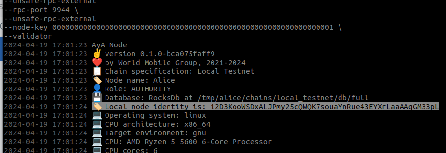
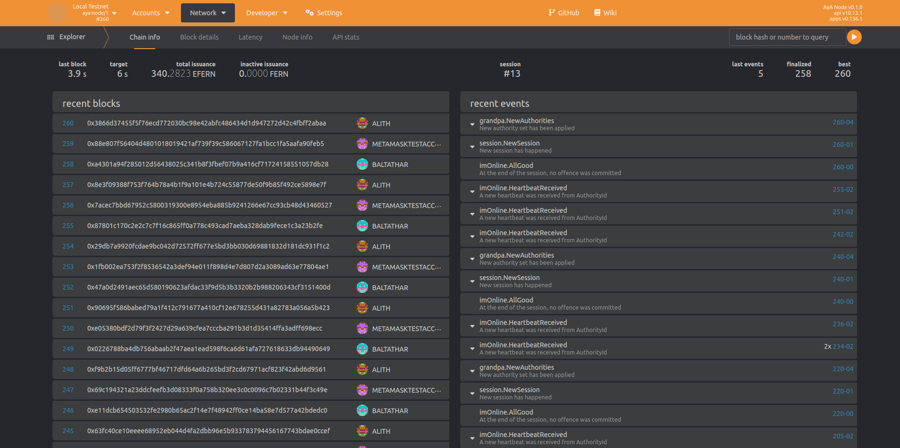

# Local Chain Setup
This guide shows how to setup a blockchain network locally using the well-known accounts. 


## Build

To build the chain, execute the following commands from the project root:

```
$ cargo build --release
```

## Purge existing chains
If you created a network before and you want to start over again you need to delete existing chain data.

Purge Alice: 
```
$ ./target/release/aya-node purge-chain --base-path /tmp/alice --chain local
```

Purge Bob: 
```
$ ./target/release/aya-node purge-chain --base-path /tmp/bob --chain local
```

## Run the first Node

To execute the first node (Alith/Alice), open a new terminal and run:

```
$ ./target/release/aya-node \
--base-path /tmp/alice \
--chain local \
--alice \
--port 30333 \
--rpc-port 9944 \
--unsafe-rpc-external
--node-key 0000000000000000000000000000000000000000000000000000000000000001 \
--validator
```

In the terminal window you will find the following line:


Copy the node key and paste it into the startup command for the second node at`--bootnodes /ip4/127.0.0.1/tcp/30333/p2p/<REPLACE ME WITH NODE KEY FROM ALICE>`

## Run the second

To execute the second node (Baltathar/Bob), open a new terminal and run:

```
$ ./target/release/aya-node \
--base-path /tmp/bob \
--chain local \
--bob \
--port 30334 \
--rpc-port 9946 \
--validator \
--bootnodes /ip4/127.0.0.1/tcp/30333/p2p/<REPLACE ME WITH NODE KEY FROM ALICE>
```

## Connect to the local network using polkadot-js

Open your browser and go to: `https://polkadot.js.org/apps/?rpc=ws%3A%2F%2F127.0.0.1%3A9944#/explorer`

Your should see something similar to: 



Congratulations you setup a local aya blockchain for development and testing. 